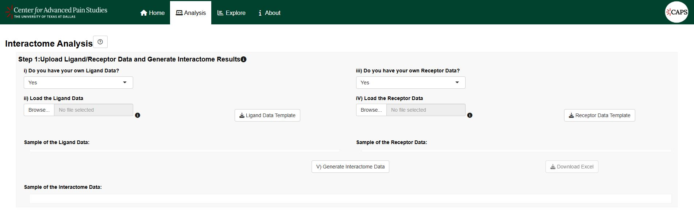
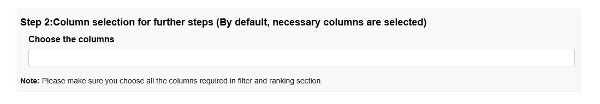
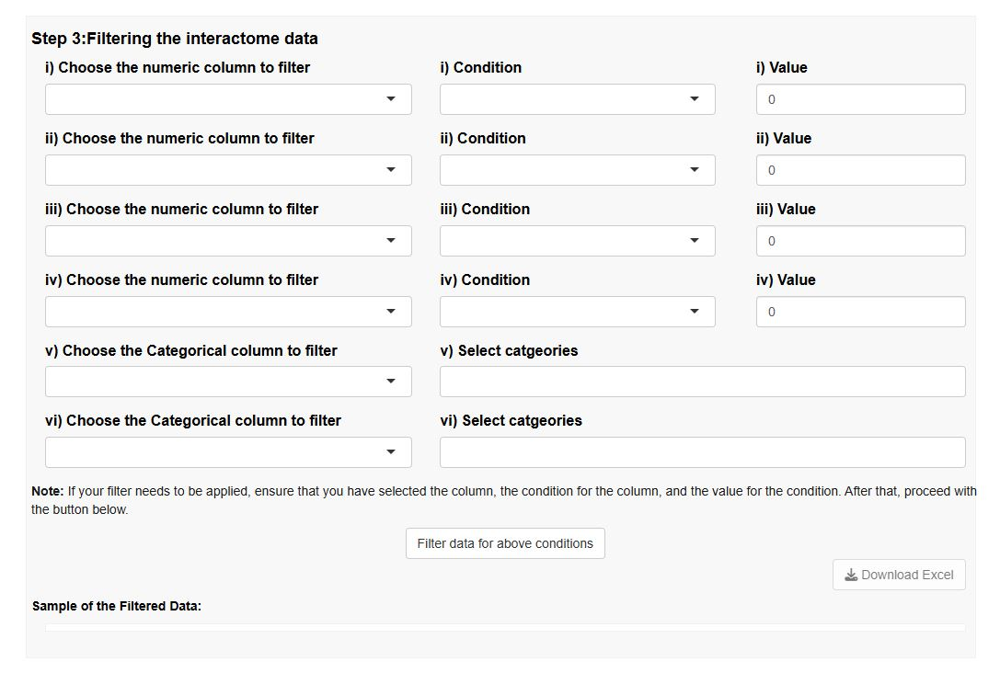
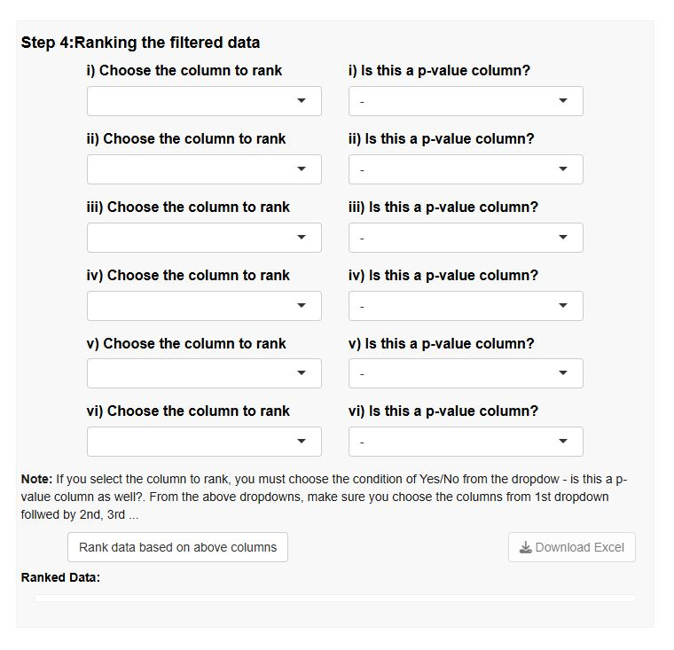
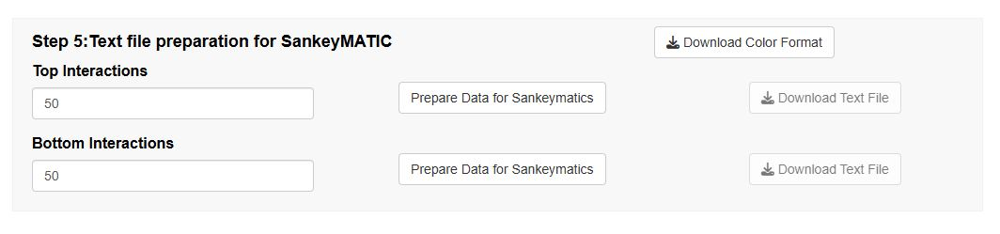
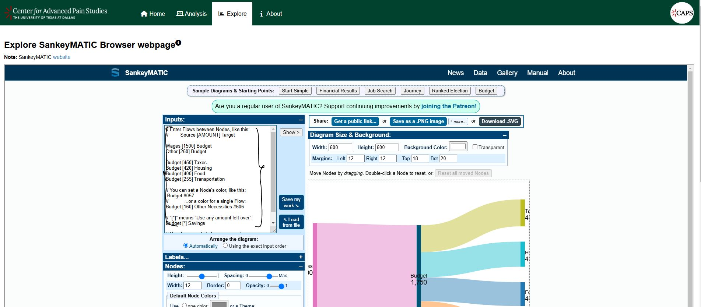

# Interactome-Analysis-Tool

This interactome analysis platform identifies potential signaling interactions between cell types of interest using transcriptomic data provided by the user and a curated ligand-receptor database.

### To play around with the application you need two input files or use existing datasets

To use this platform, 2 input files are required- (1) gene expression data from the cell type(s) providing the ligands, and (2) gene expression data from the cell type(s) that are receiving the signal with receptors (Input data should be formatted as indicated in the template).

The platform will generate a large table of all possible interactions between the ligand cells and the receptor cells, and this can subsequently be filtered and ranked using criteria defined by the user.

The platform will also generate a sankey plot file that can be used to visualize the top interactions. The Final stage results need to be copied and pasted into the [SankeyMATIC](https://www.sankeymatic.com/build/) page embedded into the "Explore"  tab in the application.

### Using the Shiny Application
#### Detailed Step-by-Step Guide

This web application has an interactive interface for easy utilization of the interactome tool. You can use the Shiny application for interactome analysis by following these steps:
1. Navigate to the [Shiny application](https://sensoryomics.shinyapps.io/Interactome/).
   
Step 1: You have the option to either upload your ligand and receptor data or use the existing data provided by the application. After data upload/selection click on "Generate Interactome" button.
 

Step 2: By default all the necessary columns will be selected to next steps and shown in selection, incase if you want to add excluded columns or remove unnecessary columns for further steps remove in the step2.

Step 3:Filtering the data, first select the column you want to filter followed by condition and finally the value for numeric columns. For categorical columns last two filters will enable to choose multiple categories in the data. After all click on "Filter data for above conditions" button. Lets keep the order of selection one after the other.

Step4: Ranking of data, ranking is based on the numerical columns ensure you choose numerical columns and select if that is a p value column then ranking is done with lowest value to highest. Click on "Rank data based on above columns".

Step5: Text file preparation for SankeyMATIC application. Choose top/bottom interaction count and click on "Prepare Data for Sankeymatics" button and download the text file.

Copy the text present in the downloaded text file and paste it in the "Explore" tab which has SankeyMATIC application embedded.

Adjust the settings to change the graph default options to make the Sankey plot look better.

## Notes
- Ensure all necessary data files are in the correct format as sample input format shown in the Shiny application.
- For any issues or questions on application, please open an issue in this repository.

---
Feel free to provide your valuuable feedback on the tool, any modifications or suggestions are welcome!
